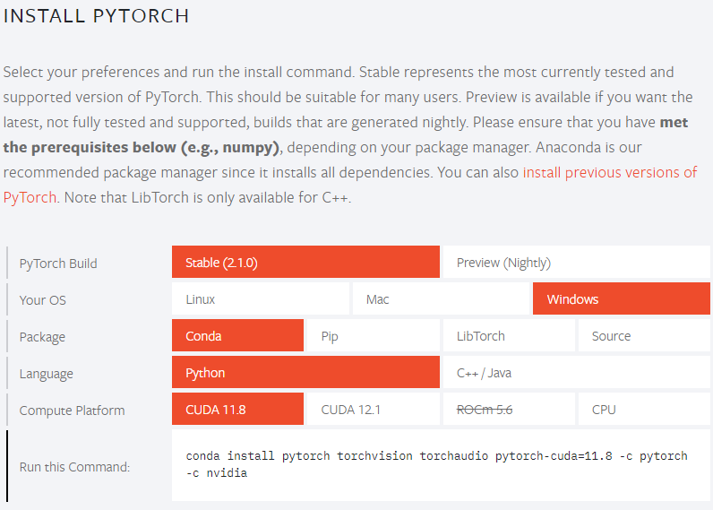
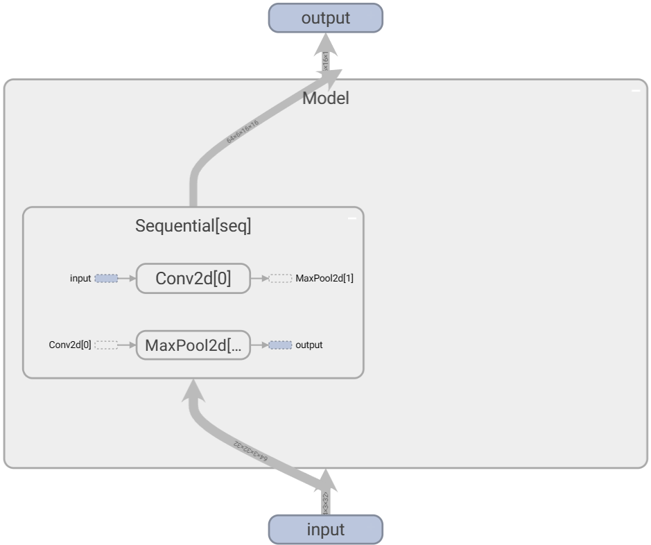
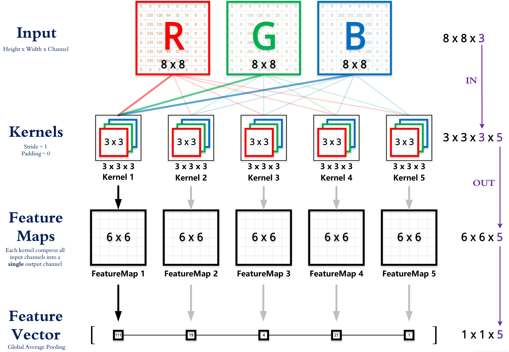
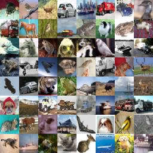
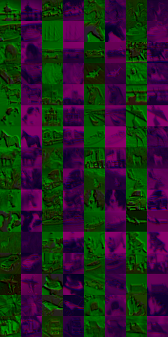
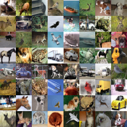
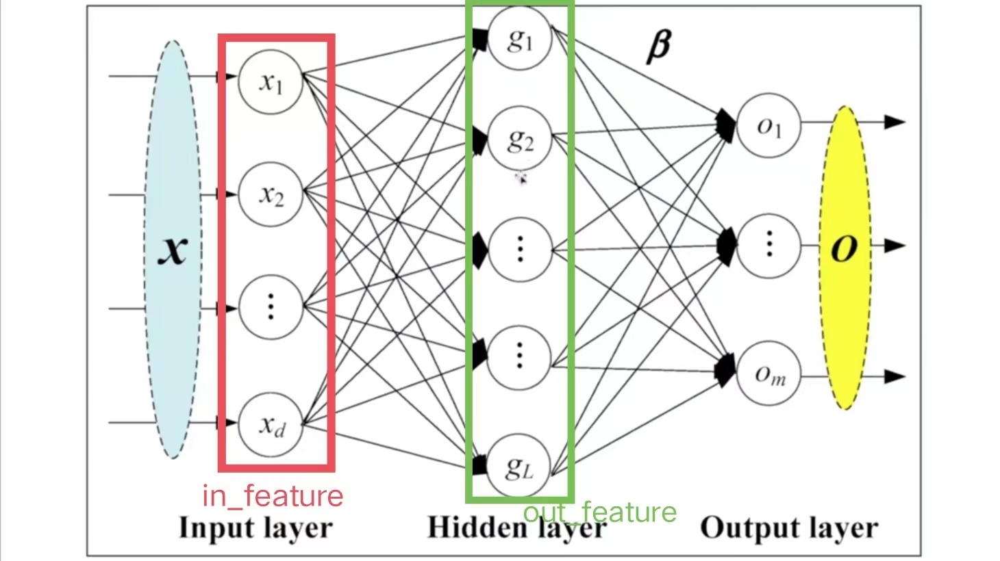
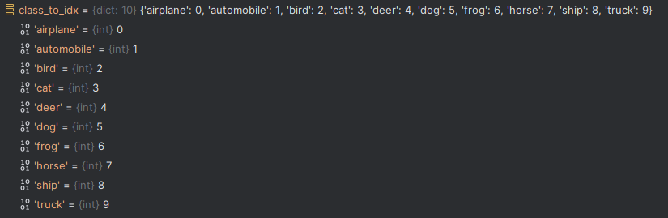

# PyTorch环境配置

## 安装步骤

1. 官网链接：www.anaconda.com，下载anaconda；

2. 为了创建虚拟环境时不创建在C盘，修改Anaconda文件夹的权限；

3. 创建pytorch虚拟环境，Python版本推荐不高于3.9

   ```powershell
   conda create -n pytorch python=3.8
   ```

4. 下载pytorch包，先去<https://pytorch.org/选择相关配置得到下载命令，如图：>

   

   会得到如下命令：

   ```powershell
   conda install pytorch torchvision torchaudio pytorch-cuda=12.1 -c pytorch -c nvidia
   ```

5. 测试是否安装成功

   ```bash
   python
   import torch
   torch.cuda.is_available()
   ## return True说明安装正确
   ```

6. CUDA版本查看

   ```powershell
   nvidia-smi
   ```

7. Jupyter工具使用

   安装anaconda时，在base环境中默认安装了，但是自己创建的环境中没有，所以在创建的虚拟环境pytorch中创建Jupyter包：

   ```powershell
   conda install jupyter notebook
   ```

   Jupyter与conda关联（Python版本不高于3.9）：

   ```powershell
   conda install nb_conda
   ```

   测试是否安装成功（启动Jupyter）：

   ```powershell
   jupyter notebook
   ```

## Python学习两大法宝

1. `dir()`函数：可以查看包有哪些分区

2. `help()`函数：查看函数具体使用方法

3. 以`torch.cuda.is_available()`为例：

   ```bash
   dir(torch) 
   # 输出以下部分
   # 'crow_indices_copy',
   # 'ctc_loss',
   # 'ctypes',
   # 'cuda',
   # 'cuda_path',
   # 'cuda_path_var',
   # 'cuda_version',
   # 'cuda_version_1',
   # 可以看见其中有'cuda'包，然后继续使用dir(torch.cuda)
   dir(torch.cuda)
   # 其中会输出'is_available'，继续使用dir(torch.cuda.is_available)就会输出前后双下划线的系统自定义标识
   # 这说明is_available()已经是一个函数了，可以使用help(torch.cuda.is_available)查看该函数的使用方法
   help(torch.cuda.is_available)
   # 输出以下内容
   # Help on function is_available in module torch.cuda:
   # is_available() -> bool
   #     Returns a bool indicating if CUDA is currently available.
   ```

## 文件、控制台、Jupyter工具

三种工具各有优缺点，组合使用

1. python文件适合大工程项目，通用，传播方便
2. 控制台能看见变量属性，但报错时显示复杂
3. Jupyter利于代码阅读及修改

# Conda常见命令

1. 查看虚拟环境

   ```powershell
   conda info --env
   ```

2. 删除虚拟环境

   ```powershell
   conda remove -n env_name --all
   ```

3. 更新conda命令

   ```powershell
   conda update -n base -c defaults conda
   ```

4. 查看源

   ```powershell
   conda config --show-sources
   ```

# Tensorboard简单使用

是一个画图工具，很好用。

## add_scalar()

```python
from torch.utils.tensorboard import SummaryWriter

writer = SummaryWriter("logs")  # logs为文件夹，也可无参构造，默认文件夹在run下

for i in range(100):
    """
        参数tag：标题
        scalar_value：纵轴
        global_step：横轴
    """
writer.add_scalar("y=x^2", i*i, i)

writer.close()
```

然后在Terminal面板中输入（--logdir是定义的事件目录，--port是定义的端口号，在服务器用默认端口可能出现被多人占用情况）：

```bash
tensorboard --logdir=logs --port=6007
```

## add_image()

```python
from torch.utils.tensorboard import SummaryWriter
from PIL import Image
import numpy as np

writer = SummaryWriter("logs")

img_pil = Image.open("hymenoptera_data/train/ants/6240329_72c01e663e.jpg")
# Image.open()图像不符合输入类型，通过numpy转成合适格式
img_array = np.array(img_pil)

"""
    tag：标题
    img_tensor：图像源，有格式要求(torch.Tensor, numpy.ndarray, or string/blobname)
    global_step：可理解为横坐标步长，每一步会渲染一次
    Shape：图像默认输入为(3,H,W)，但numpy.array转化的是(H,W,3)，所以需要转换，dataformats='HWC'指定数据格式
"""
writer.add_image("ants", img_array, 3, dataformats='HWC')


writer.close()
```

## add_graph()

画出神经网络的输入输出过程，展示细节，如下所示：

```python
writer = SummaryWriter("logs")
writer.add_graph(model, input)  # model是神经网络模型，input是输入
```

其中有两个参数：

- `model`：神经网络模型，即`nn.Module`子类，下文会讲。
- `input`：输入，即神经网络的输入。

在`tensorboard`中的`GRAPH`模块会如下显示：



# torchvision

`torchvision`主要跟视觉相关，[网页地址](https://pytorch.org/vision/stable/index.html)

## transforms模块

`transforms`相当于一个图像转换工具箱，可以将图像转化为需要的格式，如将`PIL`格式和`narray`格式的图像转换为`Tensor`格式的图像。`transforms.py`是一个`python`文件，文件中有各种类，每个类（如`Compose`，`ToTensor`，`PILToTensor`）相当于一个工具

```python
from torchvision import transforms
```

基本使用如下：

```python
from PIL import Image
from torch.utils.tensorboard import SummaryWriter
from torchvision import transforms

# 通过Python内置模块Image读取一个图片，类型为PIL
img_path = "hymenoptera_data/train/ants/9715481_b3cb4114ff.jpg"
img_pil = Image.open(img_path)

# 使用transforms将PIL格式图像转化为Tensor格式
img_trans = transforms.ToTensor()
img_tensor = img_trans(img_pil)

# print(img_tensor)

# 转换后就可以直接使用tensorboard的add_image()函数了
writer = SummaryWriter("logs")

# 添加图像
writer.add_image("tensor-img", img_tensor)

writer.close()
```

`opencv`读取的图像也是一个narray类型：

```python
import cv2
cv_img = cv2.imread(img_path)

print(type(cv_img)) # <class 'numpy.ndarray'>
```

总结以下三种图像格式：

| **类型** |       **对应函数**       |
| :------: | :----------------------: |
|   PIL    |       Image.open()       |
|  narray  | cv2.imread(), np.array() |
|  tensor  |        ToTensor()        |

`transforms`有以下相关函数：

### 1. \__call__

前后双下划线是系统内置函数

```python
class Person:
 def __call__(self, name):
  print("__call__" + "name")
  
person = Person("Jack") # __call__在创建对象时会被调用
```

### 2. ToTensor

用于转化图像格式，神经网络使用都需要转化为Tensor格式

```python
img_path = "hymenoptera_data/train/ants/9715481_b3cb4114ff.jpg"
img_pil = Image.open(img_path)

# 使用transforms将PIL格式图像转化为Tensor格式
img_trans = transforms.ToTensor()
img_tensor = img_trans(img_pil)
```

### 3. Normalize()

对图像进行归一化处理，输入要求为Tensor类型。

```python
# 有几个通道，就要给几个mean和standard deviation
# 官方定义计算公式：output[channel] = (input[channel] - mean[channel]) / std[channel]
trans_norm = transforms.Normalize([0.5, 0.5, 0.5, 0.5], [0.5, 0.5, 0.5, 0.5]) # 4个通道
img_norm = trans_norm(img_tensor) 
```

### 4. Resize()

将输入图像调整为给定大小。

```python
# 第一个参数可以是一个长宽的序列，也可是一个短边的长
# 输入可以是PIL Image，也可以是Tensor；如果是Tensor需要参数antialias=True
trans_resize = transforms.Resize([512, 512], antialias=True)
img_resize = trans_resize(img_tensor)
writer.add_image("Resize", img_resize, 0)
```

### 5. RandomCrop()

在随机位置裁剪给定的图像。输入可以是PIL或者Tensor

```python
# 裁剪大小可以是长宽指定的一个序列，或者一个int型
trans_crop = transforms.RandomCrop([256, 512])
for i in range(10):
    img_crop = trans_crop(img_tensor)
    writer.add_image("RandomCrop", img_crop, i)
```

### 6. Compose()

将一些变换组合使用，如下：

```python
# 输入要转换的组合列表，如下中先转换为Tensor格式，然后中心化处理。
# 需要注意的是，组合变换中前一个的输出是后一个的输入
trans_com = transforms.Compose([transforms.ToTensor(), transforms.CenterCrop(250)])
img_com = trans_com(img_pil)
```

## datasets模块

`Torchvision`在`Torchvision.datasets`模块中提供了许多内置的数据集，以及用于构建自己的数据集的实用程序类，[网页地址在此](https://pytorch.org/vision/stable/datasets.html#built-in-datasets)

所有数据集都是`torch.utils.data.Dataset`的子类，都实现了`__getitem__`和`__len__`函数，所以都可以传递给`torch.utils.data.DataLoader`通过多线程加载。并且所有的数据集都有相似的API接口，主要有以下几个参数：

- `root(str)`：数据集存放的本地路径
- `train(bool)`：是否从训练数据集创建，否则从测试数据集中创建
- `transform(callable)`：是一个函数，用于对图片进行转换，如输入`PIL`图像转换为`Tensor`图像
- `download(bool)`：是否下载到本地，建议始终用True。即使本地已下载，也不会再下载

### 1. CIFAR-10/100

CIFAR-10数据集由10个类别的60000张32x32彩色图像组成，每个类别有6000张图像。有50000个训练图像和10000个测试图像。基本使用如下：

```python
import torchvision
from torchvision import transforms

# train_dataset对图片进行了转换，转换为Tensor类型；test_dataset是从测试集中下载的
train_dataset = torchvision.datasets.CIFAR10("./datasets", train=True, transform=transforms.ToTensor(), download=True)
test_dataset = torchvision.datasets.CIFAR10("./datasets", train=False, download=True)

# __getitem__函数返回image, target；image是图像本身，target是类别（一个数字分别代表类别）
img, target = test_dataset[0]
img.show()
print(target)
```

# Dataset、DataLoader

`Dataset`主要是用来存储数据，比如有1000张图片，`Dataset`就存了1000张图片；而`DataLoader`是分批从`Dataset`中拿一部分数据传给神经网络，是一个数据加载器。

## Dataset

`torch.utils.data.Dataset`是一个抽象类，子类必须实现`__getitem__`和`__len__`函数，`__getitem__`函数返回一个但数据格式，如`return img, target`（其中`img`是图像，`target`是图像分类标签）。`__len__`函数返回数据集的长度，如`return len(self.data)`。当我们自定义数据集时，就写一个类继承`Dataset`，如下：

```python
from torch.utils.data import Dataset
from PIL import Image
import os

class MyData(Dataset):

    def __init__(self, imgs_dir):
        self.imgs_dir = imgs_dir # 得到存放图片的文件路径
        self.imgs_path = os.listdir(self.imgs_dir) # listdir函数可以读取该路径下所有文件，就得到了一个路径集合

    # 子类必须实现该方法
    def __getitem__(self, idx):
        img_path = self.imgs_path[idx] # 通过传入的index得到第index个图片的路径
        img = Image.open(img_path) # 通过python内置Image模块读取图片，参数是图片路径
        return img # 返回单个图片，再__init__方法中如果将路径分开，还可以返回该图片的标签，比如是蚂蚁还是蜜蜂

    # 子类必须实现该方法
    def __len__(self):
        return len(self.imgs_path)

imgs_dir = "hymenoptera_data/train/ants"
ants_dataset = MyData(imgs_dir) # 这样就得到了我们自定义的数据集
img = ants_dataset[0] # 如返回了标签，还可以这样写：img,label = ants_dataset[0]
img.show()
```

## DataLoader

`torch.utils.data.DataLoader`主要有以下几个参数，其中只有`dataset`是必须参数，其他有默认值。

- `dataset (Dataset)`：需要加载的数据集。
- `batch_size (int, optional)`：每次取多少个数据，默认为1个。
- `shuffle (bool, optional)`：有可能会对一个数据集加载多次，每一次（`epoch`）加载的顺序是否一致。`True`表示每次随机，如第一次（`epoch 1`）加载的第一批32张图片有一个顺序，第二次（`epoch 2`）加载的第一批32张图片有一个不一样的随机顺序。为`False`表示每次加载顺序一致。
- `num_workers (int, optional)`：用多少个子进程加载数据，默认0。
- `drop_last (bool, optional)`：如100个数据，每次加载3个，最后一批会只有一个，此时该参数表示是否丢弃最后一个数据，`True`表示丢弃。

举例说明，如果当前`dataset`是一个`[img, target]`类型的数据集，`DataLoader`的`batch_size=4`，则每批数据加载`DataLoader`会**随机**取四个数据的`img[0], img[1], img[2], img[3]`打包为一个`imgs`（实际训练中，会将`imgs`取出作为神经网络的一个输入），`target[0], target[1], target[2], target[3]`打包为一个`targets`。下面是一个基本使用例子的代码：

```python
import torchvision
from torch.utils.data import DataLoader
from torch.utils.tensorboard import SummaryWriter
from torchvision import transforms

# Tensorboard只接收Tensor类型图像，所以需要将数据集转换冲Tensor类型
test_dataset = torchvision.datasets.CIFAR10("./datasets", train=False, transform=transforms.ToTensor(), download=True)

# 每次加载64个数据
test_loader = DataLoader(test_dataset, batch_size=64, shuffle=True, num_workers=0, drop_last=False)

writer = SummaryWriter("dataloader")
for epoch in range(2): # 表示对数据集加载两次
    batch_step = 0 # 第一批64个数据
    for data in test_loader:
        imgs, targets = data # 每一批的64个数据，实际训练中也会将imgs取出作为神经网络的一个输入
        writer.add_images("Epoch: {}".format(epoch), imgs, batch_step) # 通过add_images将每批数据画到一个step节点(理解为一帧)上
        batch_step += 1 # 下一批64个数据

writer.close()
```

# 神经网络torch.nn

`torch.nn`是神经网络模块，`nn`是`neural network`的缩写。跟神经网络有关的都在该模块。

## Containers

自己搭建的神经网络的一些模块。其中`nn.Module`是所有神经网络中的基类。

### nn.Module

所有神经网络模块的基类。自定义的神经网络模型也应该成为这个类的子类。下面是一个基本的神经网络例子：

```python
import torch.nn as nn

class Model(nn.Module):
    # 必须重写__init__方法，并调用父类该方法
    def __init__(self):
        super().__init__()
        self.x0 = 1  #自定义了一个变量

    # forward方法是神经网络的一个处理过程，x就是神经网络的输入，对输入进行处理后输出
    def forward(self, x):
        x = self.x0 + x    # 将输入x+x0后输出
        return x
    
model = Model()   # 初始化神经网络对象
x = torch.tensor(1.0) # 定义一个Tensor类型数据
out = model(x)   # 将输入传给神经网络，经过处理后输出到out

print(out)    # tensor(2.)
```

### nn.Sequential

相当于`torchvision.transforms.Compose`，可组合许多操作，简化代码，如下所示：

```python
model = nn.Sequential(
          nn.Conv2d(1,20,5),  # 卷积操作
          nn.ReLU(),  # 非线性激活
          nn.Conv2d(20,64,5),  # 卷积操作
          nn.ReLU()  # 非线性激活
        )
```

上述代码中的具体操作将在下文讲述。

## Convolution Layers

卷积层，提供一些卷积操作，主要有下面三个常用的操作：

- `nn.Conv1d`：在由几个输入平面组成的输入信号上应用一维卷积。
- `nn.Conv2d`：在由几个输入平面组成的输入信号上应用二维卷积。
- `nn.Conv3d`：在由几个输入平面组成的输入信号上应用三维卷积。

`torch.nn`与`torch.nn.functional`中的许多函数作用类似，前者相当于是对后者的一个封装。就卷积操作来说，后者需要自己提供卷积核，而前者会根据输入自动计算一个卷积核，我们只需要提供一个卷积核的大小。所以实际应用中使用`torch.nn`即可，下面我们通过`torch.nn.functional`先了解下卷积的具体操作。

### 卷积计算

- 卷积核：在图像处理时，给定输入图像，输入图像中一个小区域中像素加权平均后成为输出图像中的每个对应像素，其中权值由一个函数定义，这个函数称为卷积核。又称**滤波器**。

对于一个输入图像若其只有一个通道，5×5个像素，卷积核为3×3，也是一个通道。卷积步长为1，padding=0。

<div align="center">
   
</div>

则运算步骤如下：

1. <div align="center">
      
   </div>

2. <div align="center">
      
   </div>

3. 一直这样计算完，每次卷积操作都会得到一个新的像素值，上面例子最后会得到3×3的结果，这就相当于是对原图像进行卷积操作后得到的特征图像。
   <div align="center">
      
   </div>

在`torch.nn.functional.conv2d`中有如下几个重要参数：

- `input – input tensor of shape (minibatch,in_channels,iH,iW)`：输入图像，但其`shape`要求为4，不满足时需要转换。
- `weight – filters of shape (out_channels,in_channel/sgroups,iH,iW)`：就是我们定义的卷积核，同样`shape`要求为4。
- `stride – Can be a single number or a tuple (sH, sW). Default: 1`：卷积核移动的步长。
- `padding - Can be a string {'valid', 'same'}, single number or a tuple (padH, padW). Default: 0`：是否需要对图像边缘进行填充。

其[参考网址在此](https://pytorch.org/docs/stable/generated/torch.nn.functional.conv2d.html#torch.nn.functional.conv2d)，下面是一个代码示例：

```python
import torch
import torch.nn.functional as F


_input = torch.tensor([[1, 2, 0, 3, 1],
                       [0, 1, 2, 3, 1],
                       [1, 2, 1, 0, 0],
                       [5, 2, 3, 1, 1],
                       [2, 1, 0, 1, 1]])

kernel = torch.tensor([[1, 2, 1],
                       [0, 1, 0],
                       [2, 1, 0]])

_input = torch.reshape(_input, (1, 1, 5, 5)) # 原为torch.Size([5, 5])，变换后为torch.Size([1, 1, 5, 5])
kernel = torch.reshape(kernel, (1, 1, 3, 3))

out = F.conv2d(_input, kernel, stride=1, padding=0)

print(out)
''' 输出以下内容
 tensor([[[[10, 12, 12],
              [18, 16, 16],
              [13,  9,  3]]]])
'''
# 上面个padding=1时，即将原图像四周填充一个0像素，变为6X6的输入，最后输出应该是5×5的
'''
 tensor([[[[ 1,  3,  4, 10,  8],
             [ 5, 10, 12, 12,  6],
             [ 7, 18, 16, 16,  8],
              [11, 13,  9,  3,  4],
              [14, 13,  9,  7,  4]]]])
'''
```

### nn.Conv2d

有几个重要参数做如下说明：

- `in_channels(int)`：输入图像通道数，RGB为3，上小节中的通道数就为1。
- `out_channels(int)`：输出通道数，每一个卷积核会输出一个通道。
- `kernel_size(int or tuple)`：卷积核的大小。
- `stride(int or tuple, optional)`：卷积步长，默认1。
- `padding(int, tuple or str, optional)`：对输入的填充，默认0。
- `padding_mode(str, optional)`：填充方式，有`zeros`，`reflect`，`replicate`，`circlular`。默认`zeros`。
- `dilation(int or tuple, optional)`：卷积核的间隔。
- `groups(int, optional)`：默认1，不常用。
- `bias(bool, optional)`：对输出的偏置，默认1，不常用。

上面参数的具体含义可通过动画展示，[地址在此](https://github.com/vdumoulin/conv_arithmetic/blob/master/README.md)。下图展示了卷积操作的过程，并展示了通道的含义：



接下来通过代码更进一步学习卷积在神经网络中的使用方法：

```python
import torch
import torchvision
from torch import nn
from torch.nn import Conv2d
from torch.utils.data import DataLoader
from torch.utils.tensorboard import SummaryWriter
from torchvision import transforms

dataset = torchvision.datasets.CIFAR10("./datasets", train=False, transform=transforms.ToTensor(), download=True)

dataloader = DataLoader(dataset, batch_size=64)


# 定义神经网络模块
class Model(nn.Module):
    def __init__(self):
        super(Model, self).__init__()
        self.conv1 = Conv2d(in_channels=3, out_channels=6, kernel_size=3, stride=1, padding=0)

    def forward(self, _input):
        return self.conv1(_input)


model = Model()

writer = SummaryWriter("logs")

step = 0
for data in dataloader:
    imgs, targets = data
    out = model(imgs)
    print(imgs.shape)  # torch.Size([64, 3, 32, 32])
    print(out.shape)  # torch.Size([64, 6, 30, 30])
    writer.add_images("images", imgs, step)

    # tensorboard无法显示6个通道的图像，所以将其转化为3个通道（该方法并不严谨）
    out = torch.reshape(out, [-1, 3, 30, 30])
    print(out.shape)  # torch.Size([128, 3, 30, 30])
    writer.add_images("conv2d", out, step)
    step += 1
```

下图是结果展示：

<div align=center>
   
    &nbsp;&nbsp;&nbsp;&nbsp;&nbsp;&nbsp;&nbsp;&nbsp;
   
</div>

有必要讲下`Shape`，在`nn.funcational.conv2d`的输入参数`input`要求其`Shape`为`minibatch,in_channels,iH,iW)`，这个`minibatch`表示什么意思呢？这跟上述代码`torch.reshape`中的第一个参数一样。后面三个参数好理解，分别是通道数，高度和宽度。`minibatch`表示最少的抓取数量，好比上图一张大图包括很多个小图。

在使用`torch.reshape()`转换时，将6个通道转换成3个通道，每张小图大小30×30，转换后保持一致；每张大图含64个小图。所以需要把3个通道的数据平铺，这样就相当于是把2个含64个小图（每个小图3通道，30×30）的大图平铺，便得到了上面第二张图的样子。

关于`nn.Conv2d`进行卷积操作时，如何得到卷积后图像的高和宽，  
可参考[官方文档](https://pytorch.org/docs/stable/generated/torch.nn.Conv2d.html#torch.nn.Conv2d)，其中有详细公式介绍。

## Pooling layers

池化层，可以在保留图像主要特征的情况下缩小图像大小，比如将1080P的视频缩小为720P。

### nn.MaxPool2d

这是最常用的池化方法，最大池化，[官方文档](https://pytorch.org/docs/stable/generated/torch.nn.MaxPool2d.html#torch.nn.MaxPool2d)，下文给出几个重要参数：

- `kernel_size`：池化窗口大小
- `stride`：移动步长，默认为`kernel_size`
- `padding`：填充大小
- `dilation`：池化窗口间隔
- `return_indices(bool)`：没啥用
- `ceil_mode(bool)`：池化方式，`True`使用`ceil`；`False`使用`floor`。`ceil`可理解为向上取整（入），`floor`向下舍去（舍）。

当`ceil_mode=True`，`kernel_size=3`时，池化窗口为3×3，对每个窗口取最大值，每次移动3步，移动到后面时窗口中可能没有9个像素，由于`ceil_mode=True`，所以选择保留，反之舍弃。下面是一个简单例子：
<div align="center">
   
</div>

1. 计算第一步：计算[[1 2 0], [0 1 2], [1 2 1]]中的最大值为2；
2. 计算第二步：像右移动3个步长，由于`ceil_mode=True`，取[[3 1], [3 1], [0 0]]中的最大值为3；反之舍弃不取；
3. 计算第三步：计算[[5 2 3], [2 1 0]]最大值为5；
4. 计算第四步：计算[[1 1], [1 1]]最大值为1

根据上面计算步骤，在`ceil_mode=True`时得到结果为[[2 3], [5 1]]；在`ceil_mode=False`时得到结果为[2]。下面是计算代码：

```python
import torch
from torch import nn


_input = torch.tensor([[1, 2, 0, 3, 1],
                       [0, 1, 2, 3, 1],
                       [1, 2, 1, 0, 0],
                       [5, 2, 3, 1, 1],
                       [2, 1, 0, 1, 1]])

out = nn.MaxPool2d(kernel_size=3, ceil_mode=True)(torch.reshape(_input, [-1, 1, 5, 5]))
print(out)
# 输出如下，与计算相符合
# tensor([[[[2, 3],
#           [5, 1]]]])
```

### 与神经网络结合

下面是一个使用例子，与卷积使用类似。

```python
import torchvision
from torch import nn
from torch.utils.data import DataLoader
from torch.utils.tensorboard import SummaryWriter
from torchvision import transforms

dataset = torchvision.datasets.CIFAR10("./datasets", train=False, transform=transforms.ToTensor(), download=True)
dataloader = DataLoader(dataset, batch_size=64)


# 定义神经网络模块
class Model(nn.Module):
    def __init__(self):
        super(Model, self).__init__()
        self.pool1 = nn.MaxPool2d(kernel_size=3, ceil_mode=True)  # 定义最大池化操作

    def forward(self, _input):
        return self.pool1(_input)


model = Model()
writer = SummaryWriter("logs")
step = 0

for data in dataloader:
    images, targets = data
    writer.add_images("origin_images", images, step)
    out = model(images)
    writer.add_images("max_pool", out, step)
    step += 1

writer.close()
```

下面是池化前后图像对比：

<div align="center">
   
   &nbsp;&nbsp;&nbsp;&nbsp;&nbsp;&nbsp;&nbsp;&nbsp;
   
</div>

## Non-linear Activations

非线性激活，主要是给输入增加一些非线性特征。

### nn.ReLU

该函数将小于0的都置为0，大于0的不变，公式如下：
<div align="center">
   
</div>

有参数`inplace(bool)`表示是否在原输入上改变值，一般用`False`不改变原值，返回新的值。

### nn.Sigmoid

[官方文档](https://pytorch.org/docs/stable/generated/torch.nn.Sigmoid.html#torch.nn.Sigmoid)，将输入变为非线性，转换为(0, 1)之间。变换公式如下：
<div align="center">
   
</div>

## Normalization Layers

[正则化层](https://pytorch.org/docs/stable/nn.html#id1)，根据一篇论文介绍，采用正则化可以加快神经网络的训练速度。

### nn.BatchNorm2d

主要有一个输入需注意：

- `num_features(int)`：`C` from an expected input of size `(N, C, H, W)`

```python
# With Learnable Parameters
m = nn.BatchNorm2d(100)  # num_features等于下面的100
# Without Learnable Parameters
m = nn.BatchNorm2d(100, affine=False)
input = torch.randn(20, 100, 35, 45)
output = m(input)
```

## Recurrent Layers

复发层，主要用于文字处理，在特定的网络中才会使用，官方文档[在此](https://pytorch.org/docs/stable/nn.html#recurrent-layers)。此外[Transformer Layers](https://pytorch.org/docs/stable/nn.html#transformer-layers)和[Sparse Layers](https://pytorch.org/docs/stable/nn.html#sparse-layers)也是在特定网络中使用。

## Linear Layers

线性层，对输入进行先行转换，[参考地址](https://pytorch.org/docs/stable/nn.html#linear-layers)

### nn.Linear

最常用的线性转换工具，[参考地址](https://pytorch.org/docs/stable/generated/torch.nn.Linear.html#torch.nn.Linear)

对输入进行线性转换。关系如下图：



```python
class torch.nn.Linear(in_features, out_features, bias=True, device=None, dtype=None)
```

几个参数含义如下：

- `in_features(int)`：输入大小，矩阵的元素个数。
- `out_features(int)`：输出大小，元素个数。
- `bias(bool)`：线性变换是否有偏置，偏置即`y=ax+b`中的`b`，默认值`True`表示有偏置，反之无。

对于一个一维的数据，`in_features`等于一维数据的个数，如下示例：

```python
_input = torch.tensor([4.0, 2.0])
out = nn.Linear(in_features=2, out_features=3, bias=False)(_input)
```

对于一个二维的数据，`in_features`等于二维数据的列数，如下示例：

```python
_input = torch.randn(2, 3)
# 计算过程为 2×3矩阵（输入） × 3×2矩阵 = 2×2矩阵
out = nn.Linear(in_features=3, out_features=2, bias=False)(_input)  # 会输出2×2的矩阵
```

可以通过`torch.flatten`将多维矩阵转换成一维矩阵，即**摊平**，然后可以再通过`Linear`线性转换，如下所示：

```python
_input = torch.tensor([[2, 3],
                       [1, 4]], dtype=torch.float32)
print(_input.shape)  # torch.Size([2, 2])

out1 = torch.flatten(_input)
print(out1.shape)  # torch.Size([4]) 数据为：[2., 3., 1., 4.]

out = nn.Linear(in_features=4, out_features=2, bias=False)(out1)
print(out)  # torch.Size([2])  数据为：[0.7599, -0.0656]
```

综合上面可以看出，`in_features`是输入矩阵的列，`out_features`是想输出矩阵的列。

## Loss Functions

损失函数，用于衡量误差。损失值=期望值-实际值，如三门课总分300，期望值=300，实际分别只考了60，70，80分，实际值=60+70+80=210分，而损失值=40+30+20=90分。损失函数主要有以下两个作用：

1. 计算实际输出和目标之间的差距；
2. 为我们更新输出提供一定的依据（反向传播）。

### nn.L1Loss

[参考文档](https://pytorch.org/docs/stable/generated/torch.nn.L1Loss.html#torch.nn.L1Loss)，该损失函数以平均绝对误差作为损失值，示例如下：

```python
input = torch.tensor([2, 3, 4], dtype=torch.float32)
target = torch.tensor([2, 4, 6], dtype=torch.float32)
loss = nn.L1Loss()(input, target)
print(loss)  # tensor(1.) = (0+1+2)/3
# loss.backward()
```

### nn.MSELoss

[参考文档](https://pytorch.org/docs/stable/generated/torch.nn.MSELoss.html#torch.nn.MSELoss)，该损失函数以均方误差为损失值，示例如下：

```python
input = torch.tensor([2, 3, 4], dtype=torch.float32)
target = torch.tensor([2, 4, 6], dtype=torch.float32)
loss = nn.MSELoss()(input, target)
print(loss)  # tensor(1.6667) = (0^2 + 1^2 + 1^2) / 3
# loss.backward()
```

### nn.CrossEntropyLoss

[参考文档](https://pytorch.org/docs/stable/generated/torch.nn.CrossEntropyLoss.html#torch.nn.CrossEntropyLoss)，主要用在分类问题中，假设现有分类问题目标有三类A、B、C序号分别为（0 1 2），现在一目测出三类概率分别为`input=[0.2, 0.3, 0.4]`，实际目标是B类（1），损失值计算示例如下：

```python
input = torch.tensor([0.2, 0.3, 0.4], dtype=torch.float32)
target = torch.tensor(1)
loss = nn.CrossEntropyLoss()(input, target)
print(loss)  # -input[target]+ln(exp(0.2)+exp(0.3)+exp(0.4))  =  tensor(1.1019)
# loss.backward()
```

该参数中的`target`是某个类别，类别由`0, 1, 2, ...`表示。

### backward()

在上述损失函数中计算出了实际值与期望值的差别，这是前面提到的第一个作用；如何将其运用在更新输出上，需要用到**反向传播**，即**损失函数返回的对象**调用`backward()`函数，反向传播可以得到需要调节的参数的梯度，有了梯度就可以运用**优化器**对参数进行调节以达到整体误差降低。

> 梯度：在一元函数中某点切线的斜率；在多元函数中可理解为该点变化最大的方向，梯度的大小表示该方向的变化率。

在代码中的`model -> seq -> Protected Attributes -> \_modules -> '0' -> weight -> grad`可以观察是否运用了梯度，其中`model`是神经网络对象，`seq`是含有神经网络操作的属性（如卷积）。

# 优化器torch.optim

[参考文档](https://pytorch.org/docs/stable/optim.html)，`optim`是一个实现各种优化算法的包。大多数常用的方法已经被支持，并且接口足够通用，所以将来更复杂的方法也可以很容易地集成在一起。其中有很多算法，但整体使用步骤如下：

1. 构造对象，其中`model.parameters()`是神经网络的参数；`lr`是学习速率，先大后小；其他参数都是每个算法的东西。

   ```python
   optimizer = optim.SGD(model.parameters(), lr=0.01, momentum=0.9)
   ```

2. 执行优化步骤：

   ```python
   for input, target in dataset:
       optimizer.zero_grad()  # 梯度清零，非常重要，避免上一次循环造成影响
       output = model(input)
       loss = loss_fn(output, target)
       loss.backward()  # 得到每一个可调节参数的梯度
       optimizer.step()  # 调用优化器对参数进行调优 
   ```

综合的使用例子：

```python
import torch.optim
import torchvision
from torch import nn
from torch.utils.data import DataLoader
from torchvision import transforms


dataset = torchvision.datasets.CIFAR10("./datasets", train=False, transform=transforms.ToTensor(), download=True)
dataloader = DataLoader(dataset, batch_size=64)


class Model(nn.Module):
    def __init__(self):
        super(Model, self).__init__()
        self.seq = nn.Sequential(
            nn.Conv2d(3, 32, 5, padding=2),
            nn.MaxPool2d(2),
            nn.Conv2d(32, 32, 5, padding=2),
            nn.MaxPool2d(2),
            nn.Conv2d(32, 64, 5, padding=2),
            nn.MaxPool2d(2),
            nn.Flatten(),
            nn.Linear(1024, 64),
            nn.Linear(64, 10)
        )

    def forward(self, x):
        return self.seq(x)


model = Model()
loss = nn.CrossEntropyLoss()
optimizer = torch.optim.SGD(model.parameters(), lr=0.01)

# 一轮代表一次学习，实际训练中往往成百上千轮
for epoch in range(20):
    running_loss = 0.0  # 可以打印每轮学习的总误差
    for data in dataloader:
        images, targets = data
        out = model(images)
        # 优化步骤
        result_loss = loss(out, targets)
        optimizer.zero_grad()
        result_loss.backward()
        optimizer.step()
        # 将每组误差加和
        running_loss = running_loss + result_loss
    # 打印每轮学习误差，可以看见总误差是不断减小的
    print(running_loss)
    # tensor(360.4428, grad_fn=<AddBackward0>)
 # tensor(355.6857, grad_fn=<AddBackward0>)
 # tensor(339.2722, grad_fn=<AddBackward0>)
 # tensor(318.3398, grad_fn=<AddBackward0>)
 # tensor(306.8174, grad_fn=<AddBackward0>)
```

# 现有网络模型的使用及参数修改

[参考文档](https://pytorch.org/vision/stable/models.html)，在`torchvision.models`模块有许多网络模型，我们可以对现有模型进行修改然后应用在自己的数据上。

## 简单使用

以`VGG16`模型为例子，[参考文档](https://pytorch.org/vision/stable/models/generated/torchvision.models.vgg16.html#torchvision.models.vgg16)，各种参数可参考官方文档。该模型中有以下参数做说明：

- `pretrained(bool)`：已弃用（官方推荐用`weights`），`False`表示默认参数，`True`表示使用网络参数（使用ImageNet训练，会下载）。
- `weights(VGG16_Weights, optional)`：是否使用预训练参数，跟上面一个意思。

代码如下：

```python
vgg16 = torchvision.models.vgg16(weights='DEFAULT')
print(vgg16)
''' 输出如下
 .......
  (classifier): Sequential(
    (0): Linear(in_features=25088, out_features=4096, bias=True)
    (1): ReLU(inplace=True)
    (2): Dropout(p=0.5, inplace=False)
    (3): Linear(in_features=4096, out_features=4096, bias=True)
    (4): ReLU(inplace=True)
    (5): Dropout(p=0.5, inplace=False)
    (6): Linear(in_features=4096, out_features=1000, bias=True)
  )
)
'''
```

## 直接添加参数

实际上在网络最后添加一层参数。

```python
vgg16.add_module("add_linear", nn.Linear(1000, 10))
print(vgg16)
''' 输出如下
 ......
    (5): Dropout(p=0.5, inplace=False)
    (6): Linear(in_features=4096, out_features=1000, bias=True)
  )
  (add_linear): Linear(in_features=1000, out_features=10, bias=True)  # 这是添加的参数
)
'''
```

## 块内添加参数

在网络某层内添加参数。

```python
vgg16.classifier.add_module("7", nn.Linear(1000, 10))
print(vgg16)
''' 输出如下
 ......
  (classifier): Sequential(
    (0): Linear(in_features=25088, out_features=4096, bias=True)
    (1): ReLU(inplace=True)
    (2): Dropout(p=0.5, inplace=False)
    (3): Linear(in_features=4096, out_features=4096, bias=True)
    (4): ReLU(inplace=True)
    (5): Dropout(p=0.5, inplace=False)
    (6): Linear(in_features=4096, out_features=1000, bias=True)
    (7): Linear(in_features=1000, out_features=10, bias=True)  # 这是在classifier块中添加的参数
  )
)
'''
```

## 修改参数

修改网络某层某个参数。

```python
vgg16.classifier[6] = nn.Linear(4096, 10)
print(vgg16)
''' 输出如下
 ......
  (classifier): Sequential(
    (0): Linear(in_features=25088, out_features=4096, bias=True)
    (1): ReLU(inplace=True)
    (2): Dropout(p=0.5, inplace=False)
    (3): Linear(in_features=4096, out_features=4096, bias=True)
    (4): ReLU(inplace=True)
    (5): Dropout(p=0.5, inplace=False)
    (6): Linear(in_features=4096, out_features=10, bias=True)  # 修改了参数，原来的out_features=1000
  )
)
'''
```

# 模型的保存与加载

先回顾下什么是模型结构和模型参数。

- 模型结构：如经过卷积层+池化层等，使用`print(model)`打印出来的是模型结构。
- 模型参数：如在经过卷积层时，只指定了卷积核的大小，卷积核具体是多少没有给出，这就是神经网络需要训练的内容。

## 保存与加载（方法一）

保存了 **模型结构+模型参数**

### 保存model_save.py

```python
vgg16 = torchvision.models.vgg16()
torch.save(vgg16, "vgg16_method1.pth")
```

### 加载model_load.py

```python
model = torch.load("vgg16_method1.pth")
print(model)
```

## 保存与加载（方法二）

只保存**模型参数**，是官方推荐方式。

### 保存model_save.py

```python
# 参数保存为字典类型
torch.save(vgg16.state_dict(), "vgg16_method2.pth")
```

### 加载model_load.py

```python
vgg16 = torchvision.models.vgg16()  # 先加载模型结构
vgg16.load_state_dict(torch.load("vgg16_method2.pth"))  # 再加载模型参数
print(vgg16)
```

## 优劣

- 方法二加载模型稍微复杂点，但是文件大小少很多。
- 方法一有一定缺陷：在自己写的一些模型中，在模型加载文件中需要引入定义的模型类（相当于引入了模型结构），但并不需要再创建模型对象啥的。

比如在`model_save.py`文件中自定义了一个模型`MyModel`，则需要在加载文件`model_load.py`中导入该定义：`from mode_save.py import *`，不然会报错。

# 完整模型训练套路

## 1. 准备数据集

```python
# 准备数据集
train_data = torchvision.datasets.CIFAR10("../datasets", train=True, transform=torchvision.transforms.ToTensor(),
                                          download=True)
test_data = torchvision.datasets.CIFAR10("../datasets", train=False, transform=torchvision.transforms.ToTensor(),
                                         download=True)
```

## 2. 加载数据集

```python
# 加载数据
train_loader = DataLoader(train_data, batch_size=64)
test_loader = DataLoader(test_data, batch_size=64)
```

## 3. 搭建神经网络

该部分单独放一个文件`model.py`，更加规范，可在文件中测试神经网络是否正确。

```python
import torch
from torch import nn


class Model(nn.Module):
    def __init__(self):
        super(Model, self).__init__()
        self.seq = nn.Sequential(
            nn.Conv2d(3, 6, 5, 1),
            nn.MaxPool2d(2),
            nn.Conv2d(6, 16, 5, 1),
            nn.MaxPool2d(2),
            nn.Flatten(),
            nn.Linear(16 * 5 * 5, 120),
            nn.Linear(120, 84),
            nn.Linear(84, 10)
        )

    def forward(self, x):
        return self.seq(x)


# 给一个输入，看是否正确输出，可测试模型是否正确
if __name__ == '__main__':
    input = torch.ones(64, 3, 32, 32)
    model = Model()
    output = model(input)
    print(output)
```

## 4. 创建网络模型

```python
# 创建网络模型
model = Model()
```

## 5. 定义损失函数

```python
# 损失函数
loss_fun = nn.CrossEntropyLoss()
```

## 6. 定义优化器

```python
# 优化器
learning_rate = 1e-2
optimizer = torch.optim.SGD(model.parameters(), lr=learning_rate)
```

## 7. 设置训练参数

```python
# 设置网络训练参数
total_train_times = 0  # 总训练次数
total_test_times = 0  # 总测试次数
epoch = 10  # 训练轮数
```

## 8. 开始训练

### Ⅰ. 优化器优化模型

```python
# 优化器优化模型
optimizer.zero_grad()
loss.backward()
optimizer.step()
```

### Ⅱ. 测试集验证

```python
# 测试集评价效果
with torch.no_grad():
    total_test_loss = 0.0
    for data in test_loader:
        images, targets = data
        out = model(images)
        total_test_loss += loss_fun(out, targets).item()
    # 打印输出
    print("--------第{}轮训练结束，测试集整体误差：{}".format(i+1, total_test_loss))
```

## 9. 加入Tensorboard

```python
writer = SummaryWriter("../model_logs")
...
writer.add_scalar("train_loss", loss.item(), total_train_times)
...
writer.add_scalar("test_loss", total_test_loss, total_test_times)
```

## 10. 保存模型

应该每轮训练结束后都保存以下模型参数。

```python
# 每轮保存模型, 参数保存为字典类型
torch.save(model.state_dict(), "model_{}.pth".format(i + 1))
```

## 11. 分类问题的正确率

```python
# 对于分类问题使用正确率更直观
total_accuracy = 0
...
# 正确率
accuracy = (out.argmax(1) == targets).sum()
total_accuracy += accuracy
...
print("--------第{}轮训练结束，测试集整体正确率：{}".format(i + 1, total_accuracy / test_size))
writer.add_scalar("test_accuracy", total_accuracy / test_size, total_test_times)
```

## 12. 细节

### Ⅰ. Module.train()

[参考地址](https://pytorch.org/docs/stable/generated/torch.nn.Module.html#torch.nn.Module.train)，用在开始训练前面，使处于训练状态，神经网络中有`Dropout`，`BatchNorm`等时，必须使用。

### Ⅱ. Module.eval()

[参考地址](https://pytorch.org/docs/stable/generated/torch.nn.Module.html#torch.nn.Module.eval)，用在测试评估前面，使处于测试状态，神经网络中有`Dropout`，`BatchNorm`等时，必须使用。

# GPU训练

## time.time()

用于计时，可比较`GPU`和`CPU`的不同，简单使用如下：

```python
import time

start_time = time.time()
end_time = time.time()
print("用时：{}".format(end_time - start_time))
```

## Module.cuda()

[参考地址](https://pytorch.org/docs/stable/generated/torch.nn.Module.html#torch.nn.Module.cuda)，将模型所有参数和缓冲数据转移到`GPU`上，需对**模型**，**损失函数**，**数据**进行转换，使用方法如下：

```python
# 模型转移
model = model.cuda()
# 损失函数转移
loss_fun = loss_fun.cuda()
# 数据转移
images = images.cuda()
targets = targets.cuda()
# 可更加严谨
if torch.cuda.is_available():
    ...
```

## torch.device()

先定义训练设备，其中参数可以是`cpu`，`cuda`，`cuda:0`等等。

```python
# 定义训练设备
device = torch.device("cuda:0")  # 只有一个英伟达显卡时可等效与"cuda"
```

然后将**模型**，**损失函数**，**数据**进行转换即可，如下：

```python
# 模型处理
model = Model().to(device)
# 损失函数处理
loss_fun = nn.CrossEntropyLoss().to(device)
# 数据和标注处理
images = images.to(device)
targets = targets.to(device)
```

该方法相比于使用`Module.cuda()`更为简洁方便，推荐使用。

定义训练设备时更为推荐的写法如下：

```python
device = torch.device("cuda" if torch.cuda.is_available() else "cpu")
```

# 完整训练代码

下面是在`train_model.py`文件中的完整代码：

```python
import torch
import torchvision
from torch import nn
from torch.utils.data import DataLoader
from torch.utils.tensorboard import SummaryWriter
from model import Model
import time

# 准备数据集
train_data = torchvision.datasets.CIFAR10("../datasets", train=True, transform=torchvision.transforms.ToTensor(),
                                          download=True)
test_data = torchvision.datasets.CIFAR10("../datasets", train=False, transform=torchvision.transforms.ToTensor(),
                                         download=True)
train_size = len(train_data)
test_size = len(test_data)
print("训练数据集大小：{}".format(train_size))
print("测试数据集大小：{}".format(test_size))

# 加载数据
train_loader = DataLoader(train_data, batch_size=64)
test_loader = DataLoader(test_data, batch_size=64)

# 定义训练设备
# device = torch.device("cuda:0")
device = torch.device("cuda" if torch.cuda.is_available() else "cpu")

# 创建网络模型
model = Model().to(device)

# 使用GPU
# model = model.cuda()

# 损失函数
loss_fun = nn.CrossEntropyLoss().to(device)
# loss_fun = loss_fun.cuda()

# 优化器
learning_rate = 1e-2
optimizer = torch.optim.SGD(model.parameters(), lr=learning_rate)

# 设置网络训练参数
total_train_times = 0  # 总训练次数
total_test_times = 0  # 总测试次数
epoch = 30  # 训练轮数

# 使用tensorboard
writer = SummaryWriter("../model_logs")

for i in range(epoch):
    print("--------第{}轮训练开始--------".format(i + 1))
    # i轮开始训练
    start_time = time.time()
    
    model.train()  # 在该模型中不是必须
    for data in train_loader:
        images, targets = data
        # images = images.cuda()
        # targets = targets.cuda()
        images = images.to(device)
        targets = targets.to(device)

        out = model(images)
        loss = loss_fun(out, targets)
        
        # 优化器优化模型
        optimizer.zero_grad()
        loss.backward()
        optimizer.step()
        
        # 打印输出
        total_train_times += 1
        if total_train_times % 100 == 0:  # 更好的观察数据
            print("train_times: {}, loss: {}".format(total_train_times, loss.item()))
            writer.add_scalar("train_loss", loss.item(), total_train_times)

    end_time = time.time()
    print("第{}轮训练用时：{}".format(i + 1, end_time - start_time))
    
    # 测试集评价效果
    # 对于分类问题使用正确率更直观
    total_accuracy = 0
    
    model.eval()  # 在该模型中不是必须
    with torch.no_grad():
        total_test_loss = 0
        for data in test_loader:
            images, targets = data
            # images = images.cuda()
            # targets = targets.cuda()
            images = images.to(device)
            targets = targets.to(device)

            out = model(images)
            total_test_loss += loss_fun(out, targets).item()
            # 正确率
            accuracy = (out.argmax(1) == targets).sum()
            total_accuracy += accuracy
            
        # 打印输出
        print("--------第{}轮训练结束，测试集整体误差：{}".format(i + 1, total_test_loss))
        print("--------第{}轮训练结束，测试集整体正确率：{}".format(i + 1, total_accuracy / test_size))
        writer.add_scalar("test_loss", total_test_loss, total_test_times)
        writer.add_scalar("test_accuracy", total_accuracy / test_size, total_test_times)
        
        total_test_times += 1

    # 每轮保存模型, 参数保存为字典类型
    torch.save(model.state_dict(), "model_{}.pth".format(i + 1))

writer.close()
```

# 完整模型测试套路

跟前面训练过程中的测试集有点类似。利用已经训练好的模型，然后给它提供一个输入，看看输出是否正确。

## 1. 准备测试数据

网上随便找一个图片，如dog，airplane，ship，truck的图片，下图：

<div style="text-align: center;">
   <span>
      
   </span>&nbsp;&nbsp;
   <span>
      
   </span>&nbsp;&nbsp;
   <span>
      
   </span>&nbsp;&nbsp;
   <span>
      
   </span>
</div>

将其转换成合适的输入格式，如下：

```python
image_path = "../imgs/ship.png"
image = Image.open(image_path).convert("RGB")  # 这步很必须，有多时候网图并不是RGB模式，有的有四个通道

transform = torchvision.transforms.Compose([transforms.Resize([32, 32]),  # 格式满足要求
                                            transforms.ToTensor()])
image = transform(image)
image = torch.reshape(image, [1, 3, 32, 32])  # batch_size也是必须的
```

## 2. 加载模型

加载我们训练的模型，如下：

```python
model = Model()
model.load_state_dict(torch.load("model_30.pth"))
```

## 3. 开始测试

```python
# 开始测试
model.eval()  # 养成习惯
with torch.no_grad():  # 养成习惯
    out = model(image)
    # print(out)
    print(out.argmax(1).item())  # 以ship为例，最后输出8
```

在我们的10分类问题中，输出的`out`是每个类别的概率，概率最大的就是结果，其中十个类别分别对应如下图：



# 开源项目怎么看

在`GitHub`上有许多优秀的项目，可将其下载到本地后，看看各种参数有没有`required`属性，一般将其删除，然后改为`default=XXX`即可。
